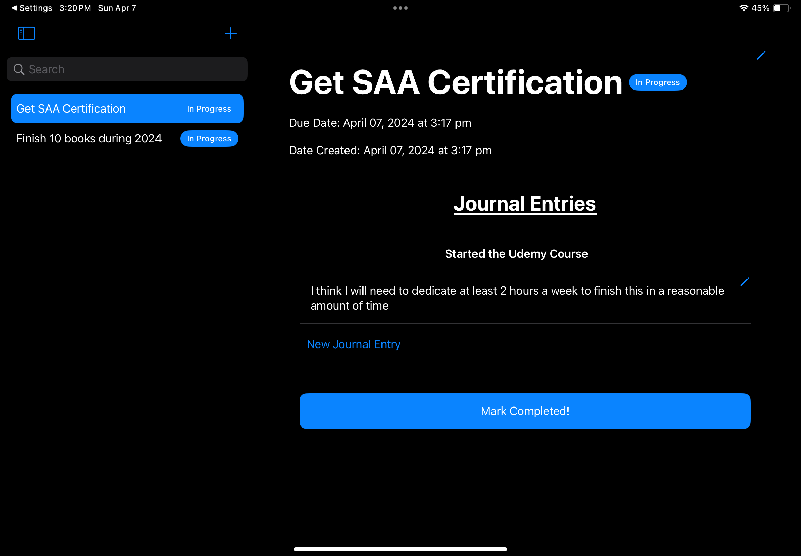
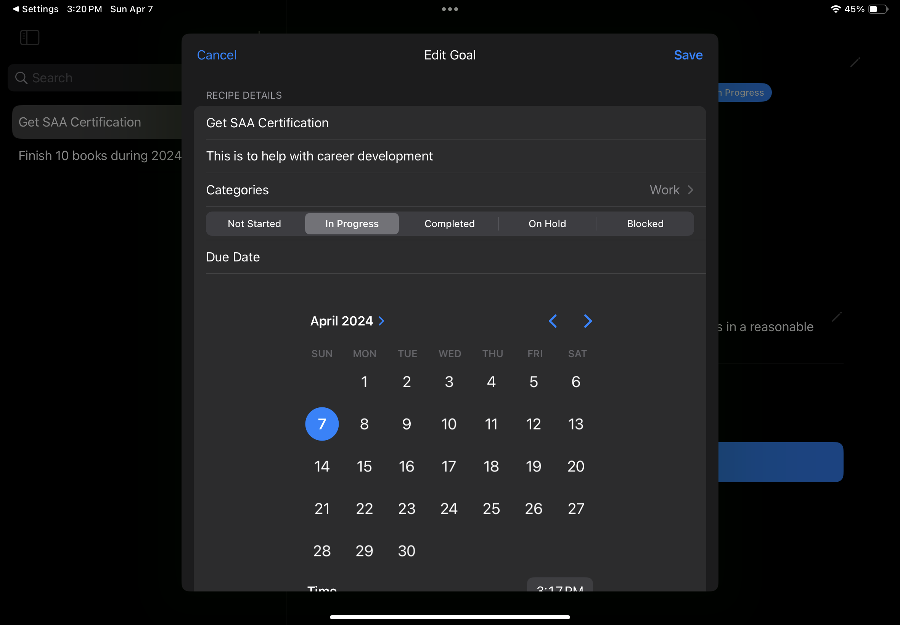
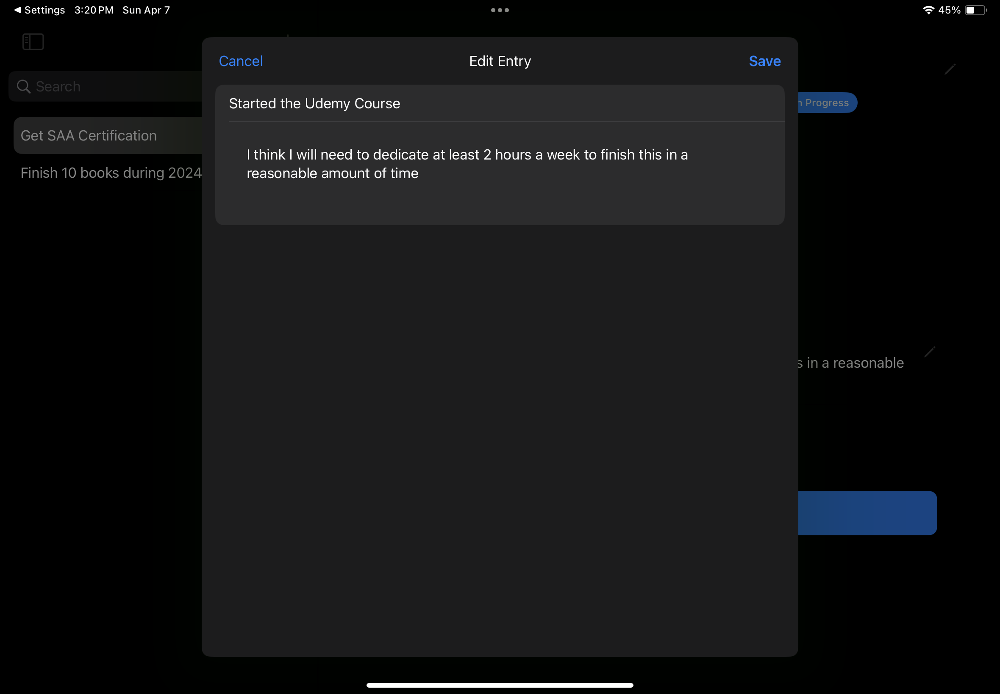
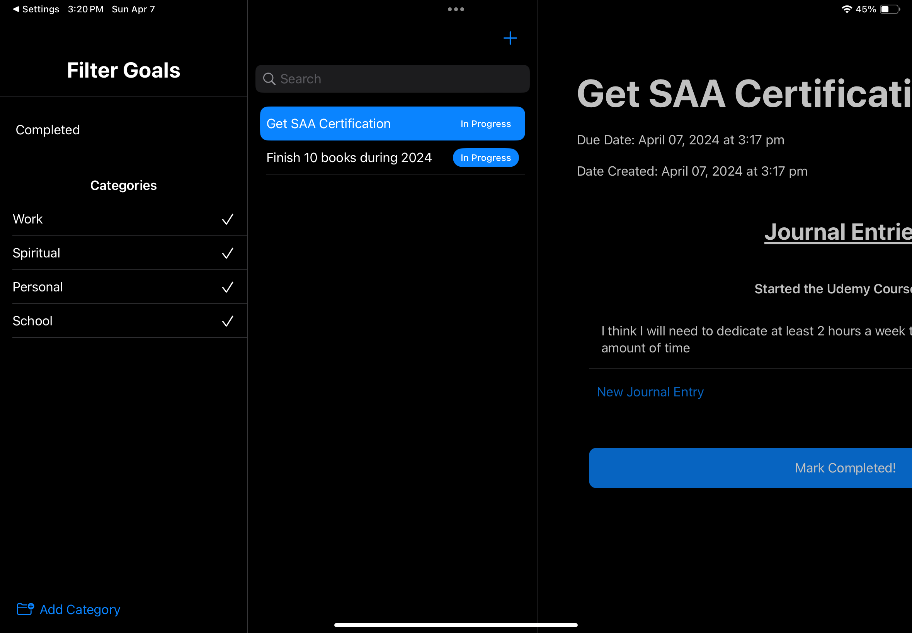
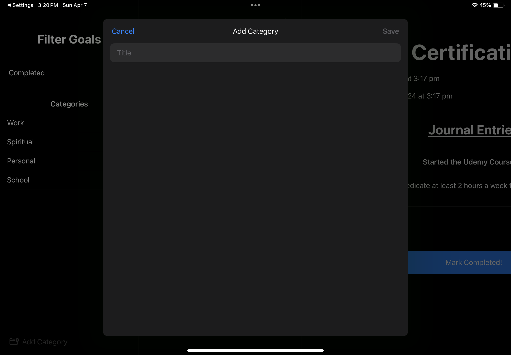
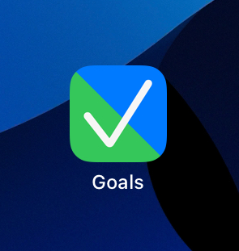

#  Goal Tracker (iOS, SwiftUI, and SwiftData)

A goal tracking app that I built in 3 hours!
Includes SwiftData models for Goals, Catgories, and Journal entries.

### Notable features:
* Save and view goals.
* Add/edit journal entries associated with your goals.
* Create categories.
* Filter by category.
* Search goals by name.
* Edit and control due dates and other details about your goals.

##### Showcase:

 
 

 
 
 

 

 

